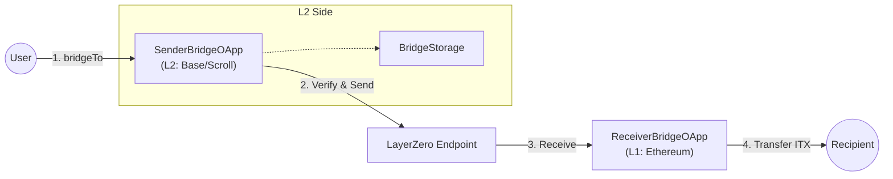

# INTMAX2 ITX Bridge Contract


Implementation of the ITX token bridge between L2s (Base, Scroll) and Ethereum using LayerZero v2.

## 🌉 Architecture



- **Sender OApp**: Calculates `delta` (Current Balance - Bridged Amount) and sends the message.
- **Receiver OApp**: Receives the message and transfers the specified amount of ITX tokens from its own balance.

## 🚀 Setup Guide (Mainnet)

### 0. Prerequisites & Environment

Ensure you have [Foundry](https://book.getfoundry.sh/) installed.
Create a `.env` file based on the following template:

```ini
PRIVATE_KEY=0x...
ETHERSCAN_API_KEY=...

# Endpoints (LayerZero V2)
L1_ENDPOINT=0x... # Ethereum Endpoint
L2_ENDPOINT=0x... # L2 Endpoint (Base/Scroll)

# Tokens
L1_TOKEN=0x... # Ethereum old ITX token address
L2_TOKEN=0x... # L2 old ITX token address

# Destination EIDs
L2_DST_EID=3... # Ethereum EID (e.g., 30101)

```

### 1. Deploy Contracts

#### Ethereum (Receiver)
```bash
# Set L1_ENDPOINT and L1_TOKEN in .env
forge script script/DeployReceiverBridge.s.sol:DeployReceiverBridge --rpc-url <ETH_RPC> --broadcast --verify
```

#### L2s (Sender)
```bash
# Set L2_ENDPOINT, L2_TOKEN, L2_DST_EID (Ethereum EID) in .env
# For Base
forge script script/DeploySenderBridge.s.sol:DeploySenderBridge --rpc-url <BASE_RPC> --broadcast --verify

# For Scroll
forge script script/DeploySenderBridge.s.sol:DeployReceiverBridge --rpc-url <SCROLL_RPC> --broadcast --verify
```

### 2. Peer Configuration (Bidirectional)

Connect L2 Sender and L1 Receiver by setting peers on both sides.

```bash
# SENDER_OAPP: Deployed SenderBridgeOApp address on L2 (Base/Scroll)
# RECEIVER_OAPP: Deployed ReceiverBridgeOApp address on L1 (Ethereum)
# <ETHEREUM_EID>: Ethereum EID (e.g., 30101)
# <BASE_EID>: Base EID (e.g., 30184)
# <SCROLL_EID>: Scroll EID (e.g., 30214)

# 1. L2 -> L1 (Run on Base/Scroll)
cast send <SENDER_OAPP> "setPeer(uint32,bytes32)" <ETHEREUM_EID> <RECEIVER_OAPP_BYTES32> --rpc-url <L2_RPC> --private-key $PRIVATE_KEY

# 2. L1 -> L2 (Run on Ethereum)
# For Base
cast send <RECEIVER_OAPP> "setPeer(uint32,bytes32)" <BASE_EID> <BASE_SENDER_OAPP_BYTES32> --rpc-url <ETH_RPC> --private-key $PRIVATE_KEY
# For Scroll
cast send <RECEIVER_OAPP> "setPeer(uint32,bytes32)" <SCROLL_EID> <SCROLL_SENDER_OAPP_BYTES32> --rpc-url <ETH_RPC> --private-key $PRIVATE_KEY
```

### 3. DVN Configuration (Critical)

Explicit DVN configuration is required for Mainnet to ensure message verification works correctly.

#### Sender Side (L2)
Configure the Sender OApp to use the correct DVN (e.g., LayerZero Labs / Google Cloud).

```bash
# SENDER_OAPP: Deployed SenderBridgeOApp address on L2
# Example for Base
export BASE_SENDER_OAPP=<Deployed_Address> # Base SenderBridgeOApp address
forge script script/ConfigureBaseOApp.s.sol:ConfigureBaseOApp --rpc-url <BASE_RPC> --private-key $PRIVATE_KEY --broadcast

# Example for Scroll
export SCROLL_SENDER_OAPP=<Deployed_Address> # Scroll SenderBridgeOApp address
forge script script/ConfigureScrollOApp.s.sol:ConfigureScrollOApp --rpc-url <SCROLL_RPC> --private-key $PRIVATE_KEY --broadcast
```

#### Receiver Side (L1)
Configure the Receiver OApp to accept messages verified by specific DVNs from each L2.

```bash
# RECEIVER_OAPP: Deployed ReceiverBridgeOApp address on L1
export L1_RECEIVER_OAPP=<Deployed_Address>

# Configure for Base
forge script script/ConfigureEthereumBaseReceiver.s.sol:ConfigureEthereumBaseReceiver --rpc-url <ETH_RPC> --private-key $PRIVATE_KEY --broadcast

# Configure for Scroll
forge script script/ConfigureEthereumScrollReceiver.s.sol:ConfigureEthereumScrollReceiver --rpc-url <ETH_RPC> --private-key $PRIVATE_KEY --broadcast
```

<details>
<summary>ℹ️ Click to see detailed UlnConfig explanation</summary>

`UlnConfig` struct defines how messages are verified:

- **confirmations**: Block confirmations to wait on source chain (e.g., 15-25).
- **requiredDVNCount**: Number of required signatures.
- **requiredDVNs**: List of mandatory DVN addresses (e.g., LZ Labs).
- **optionalDVNs**: List of optional DVNs (e.g., Google Cloud).
- **optionalDVNThreshold**: Minimum number of optional signatures required.

</details>

### 4. Receiver Token Setup

Since `ReceiverBridgeOApp` transfers existing tokens, it must be funded and authorized.

```bash
# RECEIVER_OAPP: Deployed ReceiverBridgeOApp address on L1
# ITX_TOKEN: Ethereum old ITX token address
# MINTER_ROLE: abi.encodePacked("MINTER_ROLE")
# AMOUNT: Amount of ITX to transfer (e.g., 500000000000000000000000 for 500,000 ITX)

# 1. Grant MINTER_ROLE (if required by token logic)
cast send <ITX_TOKEN> "grantRole(bytes32,address)" <MINTER_ROLE> <RECEIVER_OAPP> --rpc-url <ETH_RPC> --private-key $PRIVATE_KEY

# 2. Fund the Receiver
cast send <ITX_TOKEN> "transfer(address,uint256)" <RECEIVER_OAPP> <AMOUNT> --rpc-url <ETH_RPC> --private-key $PRIVATE_KEY
```

## 💻 Usage

### Bridge Tokens (L2 -> L1)

1.  **Quote Fee**: Check the ETH fee required for the transaction.
    ```bash
    # SENDER_OAPP: Deployed SenderBridgeOApp address on L2
    # USER: User's wallet address initiating the bridge
    cast call <SENDER_OAPP> "quoteBridge()(uint256 nativeFee, uint256 zroFee)" --from <USER> --rpc-url <L2_RPC>
    ```

2.  **Execute Bridge**: Send tokens.
    ```bash
    # SENDER_OAPP: Deployed SenderBridgeOApp address on L2
    # RECIPIENT: Desired recipient address on L1 (Ethereum)
    # NATIVE_FEE: Fee obtained from quoteBridge()
    # USER_KEY: Private key of the user initiating the bridge
    cast send <SENDER_OAPP> "bridgeTo(address)" <RECIPIENT> --value <NATIVE_FEE> --rpc-url <L2_RPC> --private-key <USER_KEY>
    ```

## 🛠 Development Commands

```bash
# Build
forge build

# Test
forge test

# Format
forge fmt

# Lint
npm i
npm run lint:fix
```


# Note for AI Clients
When modifying or adding files, you MUST run the following commands to ensure code quality and formatting standards.
If any warnings or errors occur, you MUST fix them before proceeding.

```bash
forge fmt
npm run lint:fix
``` 