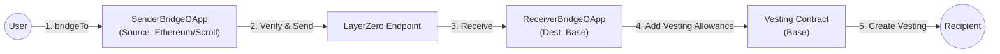

# INTMAX2 ITX Bridge Contract


Implementation of the ITX token bridge from Ethereum/Scroll to Base using LayerZero v2.

## 🌉 Architecture



- **Sender OApp**: Calculates `delta` (Current Balance - Bridged Amount) and sends the message.
- **Receiver OApp**: Receives the message and adds vesting allowance to the recipient via the Vesting contract on Base.
- **Vesting Contract**: Manages token distribution through vesting schedules. Recipients can create vesting plans using their bridge-granted allowance.

## 🚀 Deployment Guide (Mainnet)

This project includes an automated script that handles deployment, peer configuration, DVN setup, and token funding across all chains (Ethereum, Scroll, Base).

### 1. Prerequisites

Ensure you have [Foundry](https://book.getfoundry.sh/) installed.

### 2. Configure .env

Create a `.env` file with the following variables. This script uses `vm.createSelectFork`, so you must provide RPC URLs in `foundry.toml` or via environment variables if configured.

```ini
# Deployer
PRIVATE_KEY=0x... # Must have funds on Ethereum, Scroll, and Base

# --- Endpoints & EIDs (LayerZero V2) ---
# These constants are defined in the script, but ensure your foundry.toml has rpc_endpoints.

# --- Sender Configuration (Ethereum) ---
ETHEREUM_DELEGATE=0x...
ETHEREUM_OWNER=0x...
ETHEREUM_OLD_TOKEN=0x... # Old ITX on Ethereum

# --- Sender Configuration (Scroll) ---
SCROLL_DELEGATE=0x...
SCROLL_OWNER=0x...
SCROLL_OLD_TOKEN=0x... # Old ITX on Scroll

# --- Receiver Configuration (Base) ---
BASE_DELEGATE=0x...
BASE_OWNER=0x...
BASE_VESTING_CONTRACT=0x... # Vesting contract address on Base
```

### 3. Run the Automated Script

This command will:
1.  Deploy `SenderBridgeOApp` on Ethereum and Scroll.
2.  Deploy `ReceiverBridgeOApp` on Base.
3.  Configure Peers (bidirectional trust).
4.  Configure DVNs (LayerZero verification).

```bash
forge script script/DeployAndAllSetupMainnet.s.sol:DeployAndAllSetupMainnet --broadcast --verify --etherscan-api-key $ETHERSCAN_API_KEY
```

> **Note:** The script switches chains automatically. Ensure your `PRIVATE_KEY` has ETH for gas on all three chains.
>
> **Configuration Note:** The script configures the OApps to use the **LayerZero Labs DVN** with **15 block confirmations** by default. To change these settings, please modify `script/DeployAndAllSetupMainnet.s.sol`, `script/ConfigureSenderOApp.s.sol`, and `script/ConfigureReceiverOApp.s.sol`.
>
> **Important:** After deployment, the Vesting contract owner must register the ReceiverBridgeOApp as an authorized bridge by calling `IVesting.setBridge(receiverBridgeAddress, true)`. This allows the ReceiverBridgeOApp to add vesting allowances for bridged users.

## 💻 Usage (Bridging)

Once deployed, users can bridge tokens from Ethereum or Scroll to Base.

1.  **Quote Fee**: Check the Native fee required.
    ```bash
    # Run on Source Chain (Ethereum or Scroll)
    cast call <SENDER_OAPP> "quoteBridge()(uint256 nativeFee, uint256 zroFee)" --from <USER> --rpc-url <SOURCE_RPC>
    ```

2.  **Execute Bridge**: Send tokens.
    ```bash
    # Run on Source Chain (Ethereum or Scroll)
    cast send <SENDER_OAPP> "bridgeTo(address)" <RECIPIENT> --value <NATIVE_FEE> --rpc-url <SOURCE_RPC> --private-key <USER_KEY>
    ```

> ⚠️ **Important**: The `--value` must be the **exact** amount returned by `quoteBridge()`. The underlying `OAppSenderUpgradeable._payNative()` function requires `msg.value == fee.nativeFee` (not `>=`). Sending more ETH than the quoted fee will cause a `NotEnoughNative` revert.

## 🛠 Development Commands

```bash
# Build
forge build

# Test
forge test

# Format & Lint
forge fmt
forge lint src test script
npm run lint:fix
slither . --filter-paths "lib|node_modules"
```
