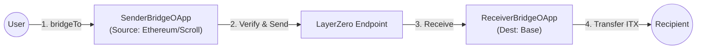

# INTMAX2 ITX Bridge Contract


Implementation of the ITX token bridge from Ethereum/Scroll to Base using LayerZero v2.

## 🌉 Architecture



- **Sender OApp**: Calculates `delta` (Current Balance - Bridged Amount) and sends the message.
- **Receiver OApp**: Receives the message and transfers the specified amount of ITX tokens from its own balance on Base.

## 🚀 Setup Guide (Mainnet)

### 0. Prerequisites & Environment

Ensure you have [Foundry](https://book.getfoundry.sh/) installed.
Create a `.env` file based on the following template:

```ini
PRIVATE_KEY=0x...
ETHERSCAN_API_KEY=...

# Endpoints (LayerZero V2)
BASE_ENDPOINT=0x... # Base Endpoint (Receiver)
ETH_ENDPOINT=0x... # Ethereum Endpoint (Sender)
SCROLL_ENDPOINT=0x... # Scroll Endpoint (Sender)

# Tokens
BASE_TOKEN=0x... # Base ITX token address
ETH_TOKEN=0x... # Ethereum ITX token address
SCROLL_TOKEN=0x... # Scroll ITX token address

# Destination EIDs
BASE_DST_EID=30184 # Base EID (Destination for all senders)

```

### 1. Deploy Contracts

#### Base (Receiver)
```bash
# Set BASE_ENDPOINT and BASE_TOKEN in .env
forge script script/DeployReceiverBridge.s.sol:DeployReceiverBridge --rpc-url <BASE_RPC> --broadcast --verify
```

#### Ethereum & Scroll (Sender)
```bash
# Set ETH_ENDPOINT, ETH_TOKEN, BASE_DST_EID in .env
# For Ethereum
forge script script/DeploySenderBridge.s.sol:DeploySenderBridge --rpc-url <ETH_RPC> --broadcast --verify

# Set SCROLL_ENDPOINT, SCROLL_TOKEN, BASE_DST_EID in .env
# For Scroll
forge script script/DeploySenderBridge.s.sol:DeploySenderBridge --rpc-url <SCROLL_RPC> --broadcast --verify
```

### 2. Peer Configuration (Bidirectional)

Connect Sender (Ethereum/Scroll) and Receiver (Base) by setting peers.

```bash
# SENDER_OAPP: Deployed SenderBridgeOApp address (Ethereum/Scroll)
# RECEIVER_OAPP: Deployed ReceiverBridgeOApp address (Base)
# <BASE_EID>: Base EID (e.g., 30184)
# <ETH_EID>: Ethereum EID (e.g., 30101)
# <SCROLL_EID>: Scroll EID (e.g., 30214)

# 1. Sender -> Receiver (Run on Ethereum/Scroll)
cast send <SENDER_OAPP> "setPeer(uint32,bytes32)" <BASE_EID> <RECEIVER_OAPP_BYTES32> --rpc-url <SOURCE_RPC> --private-key $PRIVATE_KEY

# 2. Receiver -> Sender (Run on Base)
# Link Base to Ethereum
cast send <RECEIVER_OAPP> "setPeer(uint32,bytes32)" <ETH_EID> <ETH_SENDER_OAPP_BYTES32> --rpc-url <BASE_RPC> --private-key $PRIVATE_KEY
# Link Base to Scroll
cast send <RECEIVER_OAPP> "setPeer(uint32,bytes32)" <SCROLL_EID> <SCROLL_SENDER_OAPP_BYTES32> --rpc-url <BASE_RPC> --private-key $PRIVATE_KEY
```

### 3. DVN Configuration (Critical)

#### Sender Side (Ethereum/Scroll)
Configure the Sender OApp to use the correct DVN.

```bash
# Example for Ethereum
forge script script/ConfigureSenderOApp.s.sol:ConfigureSenderOApp --rpc-url <ETH_RPC> --private-key $PRIVATE_KEY --broadcast
```

#### Receiver Side (Base)
Configure the Receiver OApp to accept messages from Ethereum and Scroll.

```bash
# Configure Base Receiver
forge script script/ConfigureBaseReceiver.s.sol:ConfigureBaseReceiver --rpc-url <BASE_RPC> --private-key $PRIVATE_KEY --broadcast
```

### 4. Receiver Token Setup (on Base)

Since `ReceiverBridgeOApp` is on Base, it must be funded with Base ITX tokens.

```bash
# RECEIVER_OAPP: Deployed ReceiverBridgeOApp address on Base
# ITX_TOKEN: Base ITX token address
# AMOUNT: Amount of ITX to transfer

# Fund the Receiver
cast send <ITX_TOKEN> "transfer(address,uint256)" <RECEIVER_OAPP> <AMOUNT> --rpc-url <BASE_RPC> --private-key $PRIVATE_KEY
```

## 💻 Usage

### Bridge Tokens (Ethereum/Scroll -> Base)

1.  **Quote Fee**: Check the Native fee required.
    ```bash
    # Run on Source Chain (Ethereum or Scroll)
    cast call <SENDER_OAPP> "quoteBridge()(uint256 nativeFee, uint256 zroFee)" --from <USER> --rpc-url <SOURCE_RPC>
    ```

2.  **Execute Bridge**: Send tokens.
    ```bash
    # Run on Source Chain (Ethereum or Scroll)
    cast send <SENDER_OAPP> "bridgeTo(address)" <RECIPIENT> --value <NATIVE_FEE> --rpc-url <SOURCE_RPC> --private-key <USER_KEY>
    ```

## 🤖 Automated Multi-Chain Deployment (Advanced)

For advanced users, a multi-chain deployment script is available to deploy contracts to Ethereum, Scroll, and Base, and automatically configure peers in a single execution.

### 1. Configure .env

Ensure all the following variables are set in your `.env` file.

```ini
# Deployer
PRIVATE_KEY=0x...

# LayerZero Config
BASE_EID=30184
# Endpoints (Required by deploy scripts)
ETH_ENDPOINT=0x1a44076050125825900e736c501f859c50fE728c
SCROLL_ENDPOINT=0x... 
BASE_ENDPOINT=0x1a44076050125825900e736c501f859c50fE728c

# Ethereum (Sender) Params
ETHEREUM_DELEGATE=0x...
ETHEREUM_OWNER=0x...
ETHEREUM_OLD_TOKEN=0x...

# Scroll (Sender) Params
SCROLL_DELEGATE=0x...
SCROLL_OWNER=0x...
SCROLL_OLD_TOKEN=0x...

# Base (Receiver) Params
BASE_DELEGATE=0x...
BASE_OWNER=0x...
BASE_OLD_TOKEN=0x...
```

### 2. Run the Script

This script uses `vm.createSelectFork` to switch between chains defined in `foundry.toml`. Ensure your `foundry.toml` has valid RPC endpoints for `ethereum`, `base`, and `scroll`.

```bash
forge script script/DeployAndSetPeerAllMainnet.s.sol:DeployAndSetPeerAllMainnet --broadcast --verify
```

## 🛠 Development Commands

```bash
# Build
forge build

# Test
forge test

# Format
forge fmt

# Lint
npm i
npm run lint:fix
```
